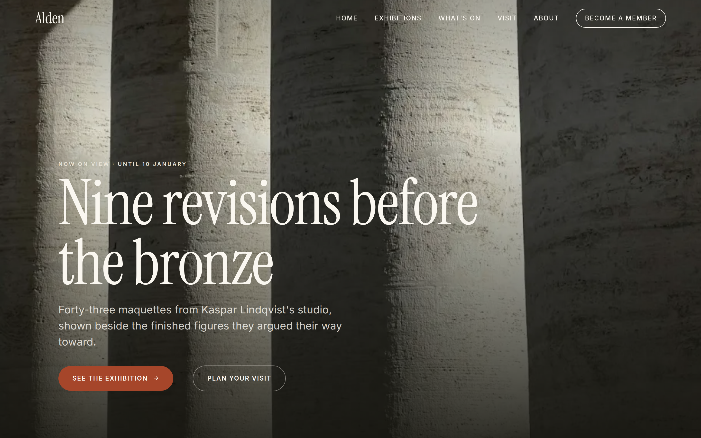
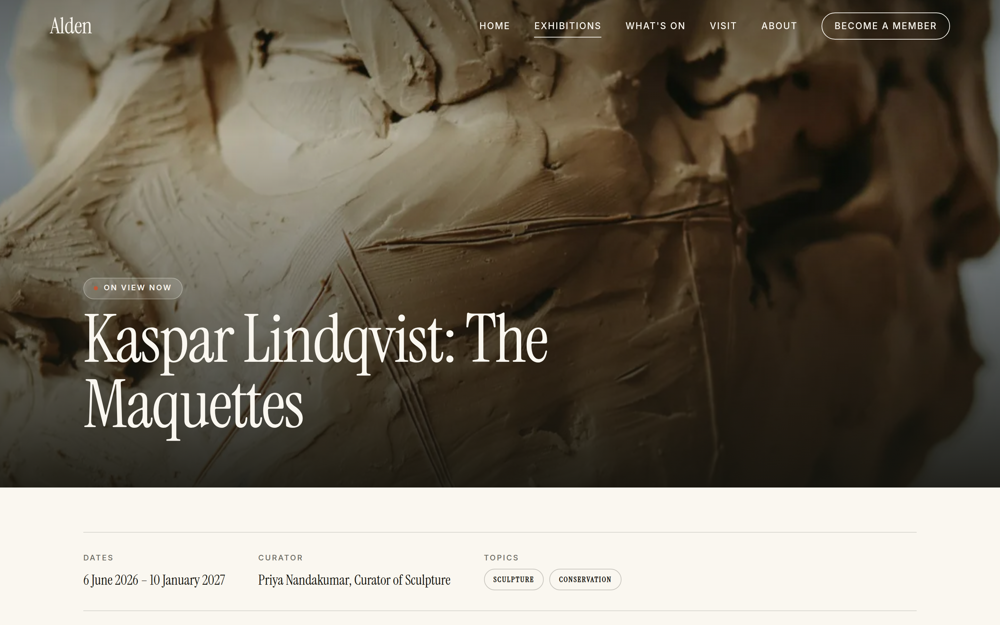
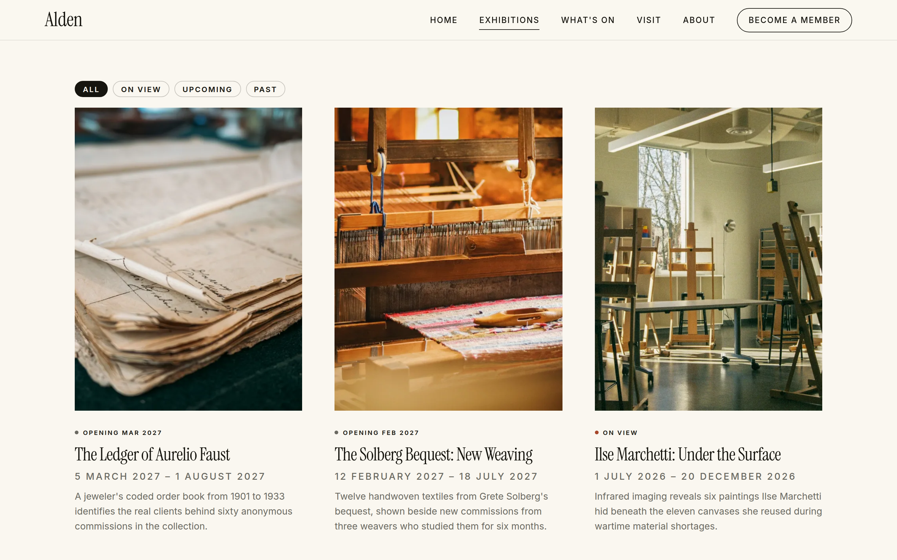

# The Alden Museum

A Drupal 11 website for a regional art museum — brand identity, design system, custom
theme, content model, and deployment, built end to end on Pantheon.

**[View the live site →](https://live-alden-museum.pantheonsite.io)**

> Hosted on a Pantheon sandbox, which shows a one-time interstitial before loading.
> Click through it.

The Alden Museum is fictional. It was invented for this project so the work could be shown
publicly without client restrictions — the institution, curators, exhibitions and artists
are all made up.



---

## Stack

| Layer | Choice |
|---|---|
| CMS | Drupal 11.4 |
| Hosting | Pantheon, Composer-managed upstream |
| Local | DDEV — PHP 8.3, MariaDB 10.6, matched to the platform |
| Theming | Custom theme from core's starterkit, Single Directory Components |
| Deployment | Git and Terminus, Dev → Test → Live |

Built on Drupal 11 rather than 10 deliberately: Drupal 10 reaches end of life on
**9 December 2026**, the same week Drupal 12 ships.

---

## What was built

Six page templates, nineteen components, four content types, twenty-four pieces of
content.

| Template | What it does |
|---|---|
| Front page | Eleven sections, full-bleed hero, scroll-triggered reveals |
| Exhibition detail | Hero, facts bar, split, pull quote, gallery grid, related events |
| Exhibition listing | Views-driven, filterable by current / upcoming / past |
| What's On | Events and journal combined, filterable by type |
| Basic page | Long-form content with a sticky sidebar |
| Membership | Pricing tiers, benefits, expandable FAQ |



Pages are assembled by editors from five component types through Paragraphs — hero,
split, card grid, CTA band, quote — so new pages stay consistent with the design system
without a developer.



---

## Design decisions

**The palette recedes on purpose.** On a museum site the artwork is the content. A
colourful brand system would compete with every image on the page, so the palette is five
warm neutrals with a single rust accent.

| Token | Value | Role |
|---|---|---|
| `--alden-ink` | `#16150F` | Text, dark surfaces |
| `--alden-stone` | `#6B6A62` | Secondary text |
| `--alden-rust` | `#A6462A` | Accent, active states |
| `--alden-mist` | `#E8E3D7` | Dividers, subtle fills |
| `--alden-bone` | `#FAF7F0` | Page background |

Every foreground and background pair was contrast-tested to WCAG 2.1 AA before use — and
one pairing failed. Stone on ink measured 2.98:1, below the 4.5:1 threshold. It only
occurred in the footer, which is exactly why testing every combination matters rather than
eyeballing the default view.

**Typography** is Instrument Serif for display and Inter for body, both self-hosted at
93 KB total across four faces, on a 1.25 modular scale expressed as fluid `clamp()` values.

**Five components, not fifteen.** A small, well-defined component set produces consistent
pages. A large one produces pages that drift.

---

## Measured results

| | |
|---|---|
| Wordmark | **2,922 bytes** — 5 vector paths, no embedded raster |
| Icon sprite | **1,876 bytes** — 7 symbols, all in use, self-hosted |
| Image styles | 22, with WebP derivatives across 5 responsive sets |
| Card image at 1440px, 3 columns | **480×360**, down from 1440×1080 |

### The card image fix

Cards were requesting a 1440×1080 derivative for a slot rendering at 395px — a 3.3×
over-fetch.

The cause is that `<source media>` evaluates against the **document viewport**, not the
element's rendered width. It has no way to know the card sits inside a three-column grid.

The fix was to replace the discrete `<picture>` breakpoint mapping with a `sizes`-based
one, where the `sizes` string is derived from the component's own `columns` prop. That way
the browser's width-descriptor algorithm — which does account for device pixel ratio —
picks correctly, and the hint can't drift away from the CSS that renders it.

### The wordmark

`logo.svg` is real vector art, not a raster in an SVG wrapper. The glyph outlines for
A-l-d-e-n were extracted from the licensed Instrument Serif font using fontTools and
positioned with the font's own advance widths. `fill: currentColor` plus Twig `source()`
inlining lets one file recolour for both the light header and the dark footer.

---

## Accessibility

- Every colour pair verified to WCAG 2.1 AA
- Skip link positioned off-canvas rather than `display: none`, so it stays in the
  accessibility tree — some screen readers skip hidden skip links entirely
- Mobile navigation follows the ARIA Authoring Practices Guide disclosure pattern: native
  `<button>`, `aria-expanded`, Escape closes and returns focus, deliberately no focus trap
  since a disclosure is not a modal
- Exactly one `h1` per page; heading levels are component props, never hardcoded
- Filters work without JavaScript, via Views exposed filters, with client-side filtering
  layered on as progressive enhancement
- All motion disabled under `prefers-reduced-motion`

---

## SEO and structured data

JSON-LD for `Museum` sitewide, plus `ExhibitionEvent`, `Event` and `NewsArticle` per
content type.

`Museum` is mapped through `schema_place` rather than `schema_organization`, because
Schema.org's actual hierarchy is Museum → CivicStructure → Place. That was verified
against the vocabulary file rather than assumed.

Page titles resolve under 60 characters through per-node metatag overrides, which leaves
the on-page `h1` unconstrained — constraining the headline to fit a search-results budget
makes editors write worse headlines.

---

## Repository layout

```
config/                    Exported Drupal configuration
docs/                      Image credits, screenshots
web/themes/custom/alden/
  components/              19 Single Directory Components
  css/                     Design tokens, base styles
  templates/               Twig overrides
  fonts/                   Self-hosted woff2
  logo.svg                 Vector wordmark
web/modules/custom/        Minimal module for module-only hooks
```

Core, contrib and `vendor/` are not committed — they build on the platform from
`composer.json`. Uploaded images live in the files directory, outside version control.

---

## Running it locally

```bash
git clone git@github.com:mohhd-salman/alden-museum.git alden
cd alden

ddev config --project-type=drupal11 --docroot=web
ddev start
ddev composer install

# import a database, then
ddev drush config:import -y
ddev drush cr
ddev launch
```

---

## Deployment

Code moves forward. Content moves backward. Configuration travels as exported YAML and is
applied separately — a deploy moves files, and the database still has to be reconciled to
them.

```bash
git push origin master                        # deploys to Dev
terminus env:deploy alden-museum.test --sync-content
terminus env:deploy alden-museum.live
terminus drush alden-museum.live -- config:import -y
terminus env:clear-cache alden-museum.live
```

---

## Credits

Photography is licensed stock from Unsplash and Pexels; individual credits are in
[`docs/IMAGE-CREDITS.md`](docs/IMAGE-CREDITS.md).

Instrument Serif and Inter are both under the SIL Open Font License.

---

**Built by [Mohd Salman Hossain](https://github.com/mohhd-salman)**.
Every architectural and design decision here is documented and defensible.
